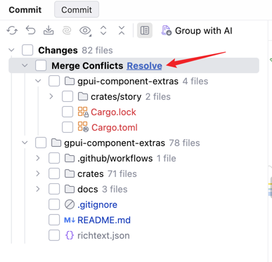
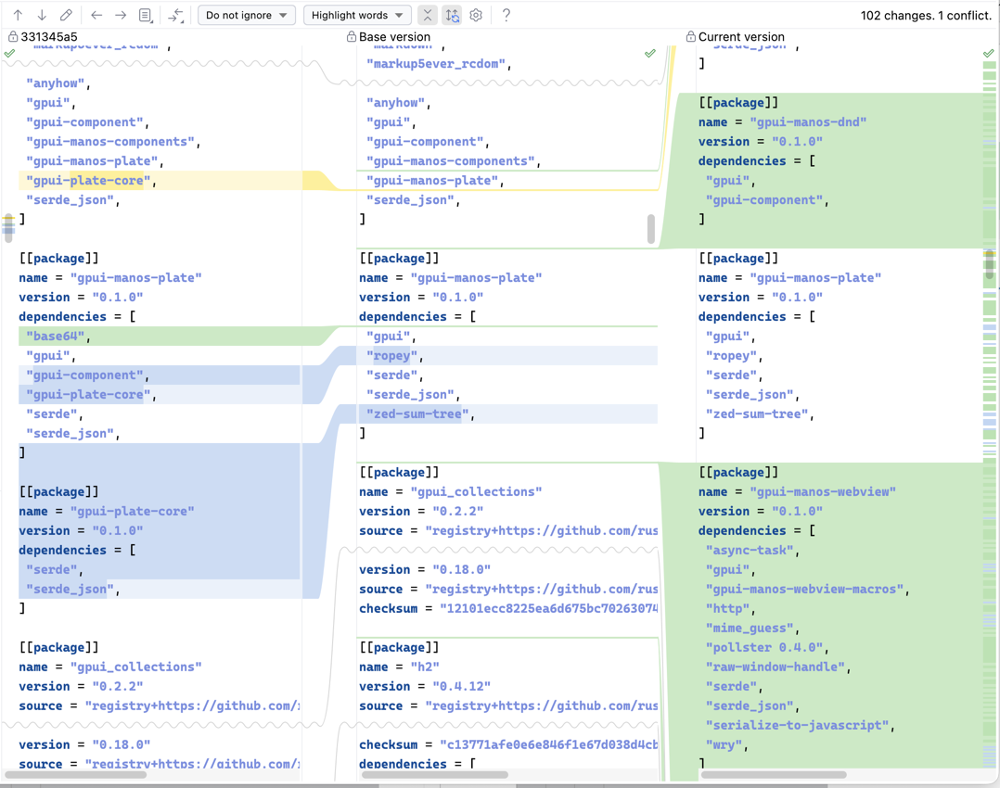

# IntelliJ liked 3-way-merge 的交互
### Changes Panel
Changes Panel 目录树上以一个单独的 Group 显示 Conflicts Files.（目前已经有了）

### 只读的 3 栏视图
右键点击冲突的文件，在弹出的菜单上点击“Open Merge Editor”，在右侧以 3 栏视图显示对比。但目前是**只读**的。
分别是 Theirs（显示 commit hash）| Base version | Current version.

三栏的 Hunks 总是对齐的，随着滚动也总是保持对齐。

Toolbar 上有 Prev Diff/Next Diff/Read View/Mark As Resolved，点击Prev Diff/Next Diff后中间栏滚动到上一个/下一个 diff 处。
注意三栏同步滚动，总是保持 hunk 对齐。
这里的交互可以参考 side-by-side diff 视图。
只不过 side-by-side 视图中我们以右侧为主，此处我们以中间 Base version 为主。

### resolve 的 3-way-merge 视图。
用户点击`Read View`按钮，该按钮变成`Resolve View`,随机中间栏 Base version 进入可编辑状态。
左侧栏与中间栏之间的 gutter 上，hunk 对应之处，提供点击交互，用户点击后，弹出菜单：`Accept >>` 和 `Ignore`.
用户点击`Accept >>`后，将左侧的 diff 应用到 Base version 上。
用户点击`Ignore X`后，表示不应用左侧，移除左侧的 Hunk 高亮。

右侧栏与中间栏之间的 gutter 上，hunk 对应之处，提供点击交互，用户点击后，弹出菜单：`<< Accept` 和 `Ignore`.
用户点击`<< Accept`后，将左侧的 diff 应用到 Base version 上。
用户点击`Ignore`后，表示不应用右侧，移除右侧的 Hunk 高亮。

`Mark As Resolved`默认置灰，当用户处理完所有冲突后，将其启用为可点击。
用户点击后表示该文件已处理完，将该文件从 "Conflicts" 组中移出。

注意：本文只说明了 3-way-merge 视图如何交互，其交互底下的逻辑你应当自行了解。强烈要求你参考 IntelliJ 的逻辑。
注意：实现交互时注意参考和复用 side-by-side 视图的实现，我们只不过从 2 栏变成了 3 栏，很多交互都是一致的。